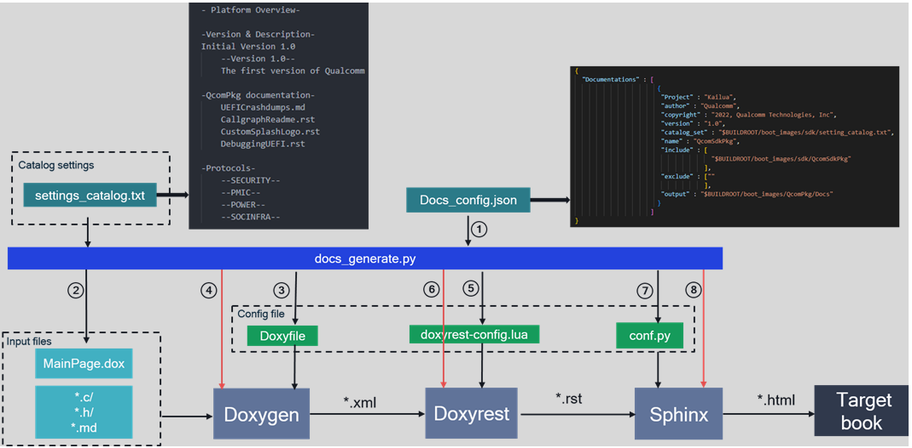
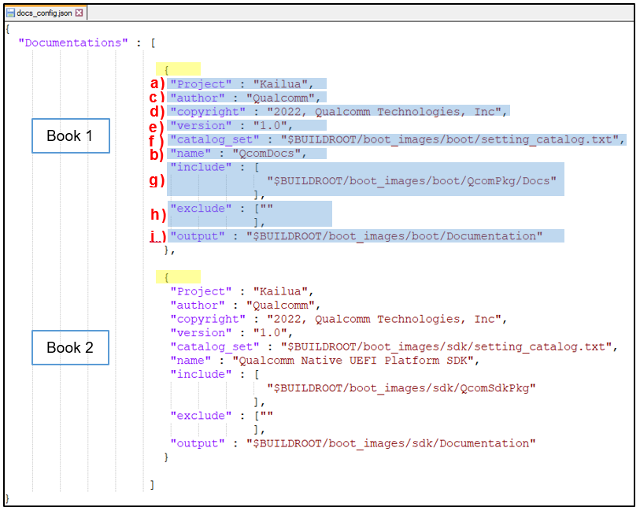
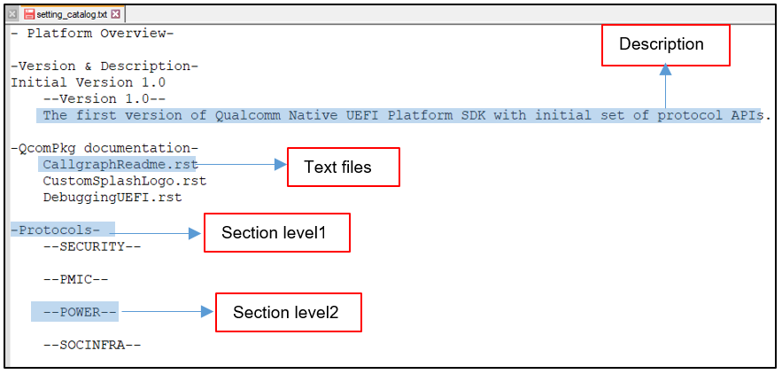
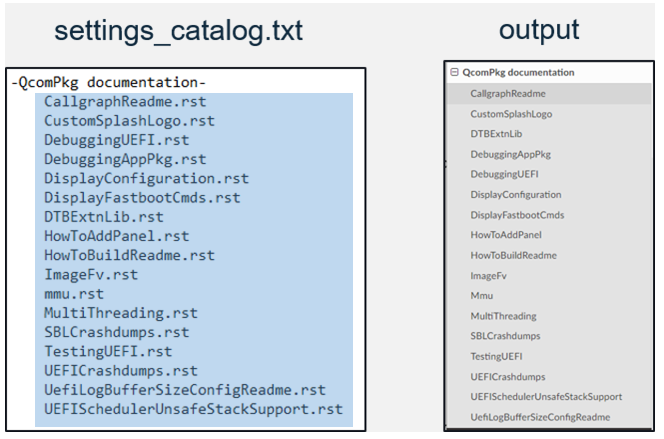
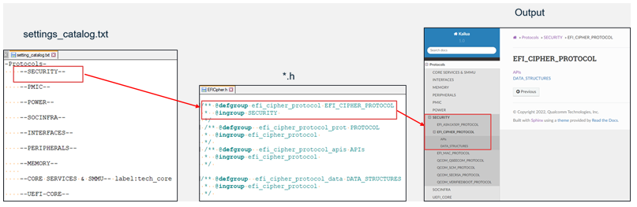

.. -*- coding: utf-8 -*-

.. /*=============================================================================
      User Manual Of Bootloader Document Generation System.
   
     Copyright (c) 2023 Qualcomm Technologies, Inc. All rights reserved.
   
                                 EDIT HISTORY
   
   
    when       who     what, where, why
    --------   ---     -----------------------------------------------------------
    02/22/23   bxr      Initial version
   =============================================================================*/

.. _user_manual:

======================
 BootDocs User Manual
======================

1. Introduction
---------------

**Bootloader document generation system (BDGS)** is to build HTML documentation 
for source code and rst docs by Doxygen, Doxyrest and Sphinx. 

`Doxygen <https://doxygen.nl/>`_ is the actual standard tool for generating documentation from annotated source code 
of programming languages, such as C, C++, PHP and Java.

`Doxyrest <https://github.com/vovkos/doxyrest>`_ is a file-conversion tool which helps to parse Doxygen output databases and 
produce RST files suitable for being passed to Sphinx.

`Sphinx <https://www.sphinx-doc.org/en/master/index.html>`_ is a documentation generator that translates a set of plain text files into various output formats 
like HTML, PDF, manual pages and much more.

2. Infrastructure
-----------------

   
   Figure 2-1 BDGS Infrastructure
   
   *Note: Step 1/2/3/5/7 - running process by docs_generate.py; Step 4/6/8 - core steps by tools*

1) Figure out the settings of book from *docs_config.json*;

2) Parse section configuration in *settings_catalog.txt* and automatically generate *MainPage.dox* (Doxygen chapter list);

3) Source file paths (include and exclude path) are added in Doxyfile (Doxygen configuration file);

4) Produce XML files for source files by Doxygen;

5) Update *doxrest-config.lua* (Doxyrest configuration file);

6) Convert files from XML to RST by Doxyrest;

7) Prepare *config.py* (Sphinx configuration file);

8) Build on-line HTML book by Sphinx.

3. Settings
-----------

3.1 Book settings
^^^^^^^^^^^^^^^^^

*docs_config.json* is the settings for generating books. It's in ``boot_images/boot_tools/document_tools/docs_config.json``.

As shown in figure 3.1-1, use curly brace ``{}`` to represent one book. Item **[a-i]** are all needed. 
Only item value of ``exclude`` is not mandatory.
Multiple books are allowed ( add one more ``{}`` for one more book ).

   
   Figure 3.1-1 Example of docs_config.json

a) **Project:  <project name>**

    Project is the target name for current book, like Kailua. When running the script *docs_generate.py* with ``-p <project name>``, 
    the generation system will search the project object according to the ``project name``.
   
b) **name: <book name>**

    Naming the book. The ``- b`` option of script *docs_generate.py* is used to match the book name in the json file.
   
c) **author: Qualcomm**

    It must be Qualcomm.
   
d) **copyright: <years>, Qualcomm Technologies, Inc**

    It should be years, followed by Qualcomm Technologies, Inc.
   
e) **version:<book version>**

    Version of the book.
   
f) **catalog_set: <file path of settings_catalog.txt>**

    The path of *settings_catalog.txt*. Please refer to :ref:`catalog-settings-label`.
   
g) **include: <input directory path>**

    Input paths of source code files and rst doc files, which are built in to generate the book.
    
    .. Note::
    
       If the file listed in settings_catalog.txt is not in ``include``, it will not be built.
   
h) **exclude:<directory path of excluded files>**

    The subset of file paths in ``include``. Files in exclude path will not be handled by our generation system.
   
    .. Note::
    
       Value of this item can be empty, like ``exclude: []``.
   
i) **output: <output book path>**
   
    Specify the output path of generated book. Final output path will be ``<output book path> /<project name>/<book name>``. 

.. _catalog-settings-label:

3.2 Catalog settings
^^^^^^^^^^^^^^^^^^^^

*settings_catalog.txt* is a configuration file to manage catalog in figure 3.2-1. Every book must have its own catalog configuration file. 
The path of *settings_catalog.txt* should be filled in ``catalog_set`` object of *docs_config.json*.

   
   Figure 3.2-1 Example of settings_catalog.txt

1) **Section definition**

    The number of ``-`` means section levels, like ``-<>-`` means section level1.
    Section names are the key words which can be used in source code by ``@ingroup``.

2) **Text files**

    The generation system only support ``*.rst`` text format and its root file ``*.index`` temporarily.

3) **Description**

    Plain text is allowed to be added in corresponding section directly.

4. Rules of documenting
----------------------

4.1 Add text files
^^^^^^^^^^^^^^^^^^

Now ``*.rst`` file format is supported for text files. The files included in the section 
which are defined in *settings_catalog.txt* will be output to corresponding section of the book. 

In figure 4.1-1, left part is the ``*.rst`` files under section ``QcomPkg documentation`` in *settings_catalog.txt*, 
right represents the catalogs in output book.

   
   Figure 4.1-1 Input-Output of text files

Refers to rst rules https://www.sphinx-doc.org/en/master/usage/restructuredtext/index.html.

4.2 Documenting source code
^^^^^^^^^^^^^^^^^^^^^^^^^^^

Only ``*.h`` file format is supported to generate the book. Different with text file, source code is not obviously listed in *settings_catalog.txt*.
This is related to Doxygen group rules. Doxygen use command ``@defgroup`` and ``@ingroup`` to interconnect the sections 
(`Doxygen Manual: Grouping <https://doxygen.nl/manual/grouping.html>`_).

In figure 4.2-1, ``@ingroup SECURITY`` must be added in the header file to link to section ``SECURITY``, 
Doxygen will group this part into ``SECURITY`` section automatically. 

Refer to more Doxygen rules https://www.doxygen.nl/manual/index.html.

   
   Figure 4.2-1 Input-Output of source code
   

5. Build commands
-----------------

**Usage**::

   python docs_generate.py -p <project name> -b <book name>
   -p:  optional. It's used to search the project related the settings in docs_config.json
   -b:  optional. It's used to match the book with all book settings in docs_config.json

**Example**:

  1) Generate book for Kailua QcomSdkPkg::
  
      python boot_images/boot_tools/document_tools/docs_generate.py -p kailua -b QcomSdkPkg
    
  2) Generate all the books::
  
      python boot_images/boot_tools/document_tools/docs_generate.py

**Dependencies**::

   Python >= 3.8.2
   Ubutun >= 20.0.0
   
